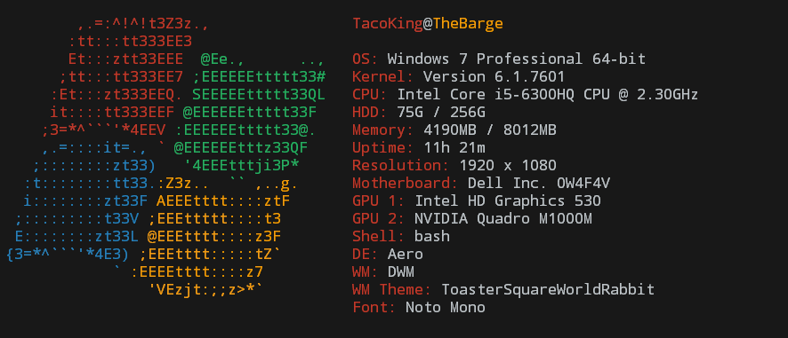

# WinScreenyReborn
WinScreenyReborn is an improved and modified bug-fix version of BitsyByWill's revamped version of nijikokun's WinScreeny.  It all works now, it has more features, and it supports Windows 8 and 10.

## Getting Started
This program only works on Windows (XP to 10). Moreover, Cygwin is required for this program to work. You can run it with `sh screeny.sh`, add an alias for it in your bash profile / bashrc, or use the `install.sh` script (chmod +x it if necessary) to have it copied to your `/bin` directory. Also, please make sure your terminal screen is large enough for all the text to fit (you will know when to resize it based on the output).

## Usage
	-v		Display script version
	-h		Display this file

## Authors
* **Chongo Bong** - [bongochong](https://github.com/bongochong) - Fixed several bugs, added a few new features, removed some garbage, and will actually keep WinScreeny updated.

* **Will Liu** - [BitsByWill](https://github.com/BitsByWill) - Made WinScreeny nicer, and also did some not so nice things.

* **Nijiko Yonskai** - [nijikokun](https://github.com/nijikokun) - Original creator of WinScreeny.

---

## What's Next?
Making sure that this neat little script stays bug-free and up-to-date.

## License
This project is licensed under GNU GPLv3 - see the [LICENSE](LICENSE) file for details
