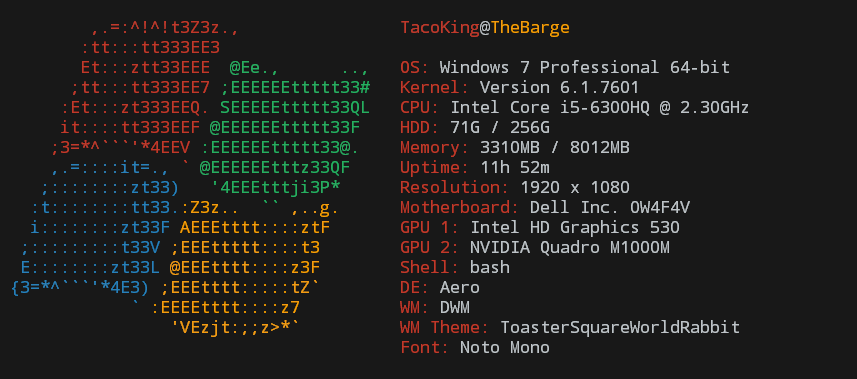

# WinScreenyReborn
WinScreenyReborn is an improved and modified bug-fix version of BitsByWill's revamped version of nijikokun's WinScreeny. It all works now, it has more features, and it supports Windows 8 and 10.

## Getting Started
This program only works on Windows (XP to 10) with Cygwin installed. You can run it via Cygwin's terminal with `sh screeny.sh`, add an alias to it in your bash profile / bashrc, or use the `install.sh` script to have it placed in your `/bin` directory (in which case you'd simply run it as `screeny`).
  
[The installer](https://raw.githubusercontent.com/bongochong/WinScreenyReborn/master/install.sh) can be run as follows: `lynx -source "https://raw.githubusercontent.com/bongochong/WinScreenyReborn/master/install.sh" > ~/install.sh && chmod +x ~/install.sh && sh ~/install.sh && rm ~/install.sh` and it will always install the latest version.

Alternatively, you can always run the latest version of WinScreenyReborn by aliasing the following command in your bash profile / bashrc: `curl -s -q https://raw.githubusercontent.com/bongochong/WinScreenyReborn/master/screeny.sh | bash`

You may need to increase the size of your terminal depending on your font-size and such when using this script (you will know if you do).
  
## Usage
	-v		Display script version
	-h		Display this file

## Authors
* **Chongo Bong** - [bongochong](https://github.com/bongochong) - Forked WinScreeny when it became abandoned once again. It was in a sorry state. Fixed all the bugs he could find, made the things work again, added a few new features, removed some garbage, and will actually keep WinScreeny updated.

* **Will Liu** - [BitsByWill](https://github.com/BitsByWill) - Forked WinScreeny when it became abandoned. Made some things nicer, and made some things work again. Also did some not so nice things, and made some things not work (or they just broke over time and he didn't fix them, I can't tell, and I don't want to be unncessarily harsh).

* **Nijiko Yonskai** - [nijikokun](https://github.com/nijikokun) - Original creator of WinScreeny. A great man.

---

## What's Next?
Making sure that this neat little script stays bug-free and up-to-date.

## License
This project is licensed under GNU GPLv3 - see the [LICENSE](LICENSE) file for details
