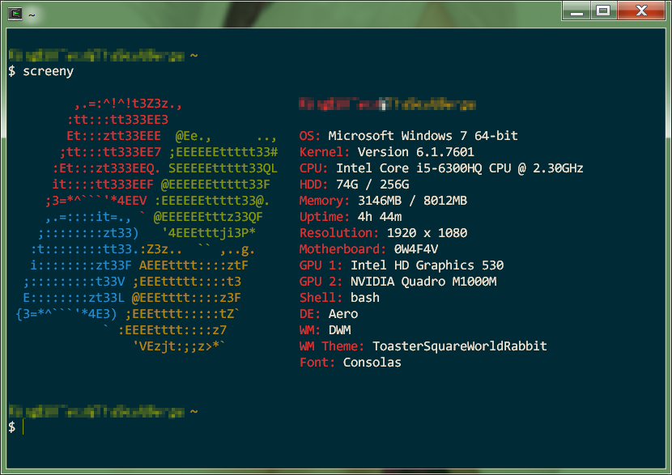

# WinScreenyFixed
WinScreenyFixed is a bug-fix version of BitsyByWill's revamped and improved version of nijikokun's WinScreeny.  It all works, has more features, and there is now support for Windows 8, 8.1, and 10.

## Getting Started
This program only works on Windows (XP to 10).  Moreover Cygwin and the most basic packages are required for this program to work.
Once you download the shell script, chmod +x it, and then you will be able to run it.  You can use the "install" script for it (chmod +x it).  Also, please make sure your terminal screen is large enough for all the text to fit (you will know when to resize it based on the output).

## Usage
    -v                 Display script version
    -h                 Display this file

## Authors
* **Chongo Bong** - [bongochong](https://github.com/bongochong) - Fixed some bugs, added a new feature, removed some garbage, and will actually keep WinScreeny updated.

* **Will Liu** - [BitsByWill](https://github.com/BitsByWill) - Made WinScreeny nicer, and also did some not so nice things.

* **Nijiko Yonskai** - [nijikokun](https://github.com/nijikokun) - Original creator of WinScreeny.

---

## What's Next?
Making sure that this neat little script stays bug-free and up-to-date.

## License
This project is licensed under GNU GPLv3 - see the [LICENSE](LICENSE) file for details

